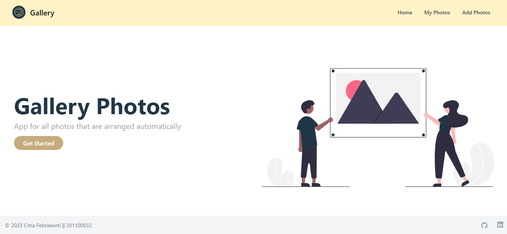

# Photo Gallery App

## Final Course Project

### NOTES

- Pada skeleton kode yang terdapat file `main.test.js` tidak boleh diubah sama sekali.
- Dilarang mengganti nama function yang diberikan.
- Dilarang mengganti atau mengutak-atik file pada folder `server`.
- Wajib menjalankan `npm install` atau `pnpm install` sebelum mengerjakan final project.

## Description

[](https://drive.google.com/file/d/1vUfVdAJsMg3oZWPwC6QbW5rjqZrobAw2/view?usp=sharing)
Klik gambar untuk melihat video preview

Untuk final project kali ini, terdapat sisi _client_ dan _server_. Pada sisi server berada pada folder `server` dan kalian hanya diminta untuk menjalankannya dengan perintah `npm run start:server`. Sedangkan untuk sisi _client_ kalian diminta untuk membuat **CRUD** dengan ketentuan dibawah ini.

### Header `application/json` ketika melakukan request selain `GET`

Pastikan ketika teman-teman melakukan request selain `GET` untuk menambahkan header `application/json`.

### Create - `POST`

Untuk proses _create_ kalian diminta untuk mengerjakan pada file `AddPhoto.jsx`, dan melakukan `POST` data ke API yang terdapat pada _local server_ dengan url berikut:

```txt
http://localhost:3001/photos
```

Kalian diminta untuk melakukan _create new data_ yang akan dikirim ke server. Data yang perlu kalian buat terdiri dari beberapa hal, yaitu:

- `imageUrl` : berisi url dari photo yang akan kalian _upload_ dalam bentuk `string`.
- `captions` : berisi captions dari photo yang akan kalian _upload_ dalam bentuk `string`.
- `createdAt` : berisi tanggal dan waktu kapan kalian _upload_ dalam bentuk `string`.
- `updatedAt` : berisi tanggal dan waktu kapan kalian _upload_ atau terkahir kali kalian melakukan _edit_/_update_ data dalam bentuk `string`.
- `secret` : berisi `secret` untuk melakukan _upload_ data dalam bentuk `string`. `secret` memiliki beberapa ketentuan, antara lain:

  - Memiliki nilai berupa `string` "**password**".
  - Jika nilai pada `secret` berupa `string` "password", maka proses _create_ berhasil dan halaman berpidah ke _path_ `/photos` dan menampilkan seluruh data termasuk data terbaru yang di uplaod.
  - Jika nilai pada `secret` **TIDAK** berupa `string` "password", maka proses _create_ di nyatakan gagal dan pada bagian atas `form` akan menunjukan _error messege_ yang di bawa dari _server_ berupa "**You are not authorized**".

| Fields    | Data type |
| --------- | --------- |
| imageUrl  | string    |
| captions  | string    |
| createdAt | string    |
| updatedAt | string    |
| secret    | string    |

Untuk `createdAt` dan `updatedAt` **tidak perlu dibuat fields khusus pada form**, kalian diperbolehkan memberikan nilainya secara langsung pada bagian `body` yang dikirim pada _method_ `fetch`.

### Read All- `GET`

Untuk proses _read all_ kalian diminta untuk mengerjakan pada file `Photos.jsx`, dan melakukan `GET` data dari API yang terdapat pada _local server_ dengan url berikut:

```txt
http://localhost:3001/photos
```

Setiap kali component `Photos` dirender maka secara otomatis data akan langsung di tampilkan. Pada file ini juga kalian diminta untuk melakukan _sort by id_ dan _search_ data yang akan dilakukan pada server dengan cara melempar _query params_ pada url dengan format berikut:

- `_sort` : parameter yang digunakan untuk menentukan berdasarkan properti apa yang digunakan ketika melakukan _sort_ data. misal, `_sort=id`
- `_order` : parameter yang digunakan untuk menentukan bentuk urutan ketika melakukan _sort_ data. misal, `_order=asc`
- `q` : parameter yang digunakan untuk mencari data berdasarkan keyword yang dijadikan valuenya. misal, ketika kita ingin mencari data dengan kata "banyak", maka kita bisa melakukannya dengan cara `q=banyak`

### Read by Id - `GET`

Untuk proses _read by id_ kalian diminta untuk mengerjakan pada file `EditPhoto.jsx`, dan melakukan `GET` data berdasarkan `id` dari API yang terdapat pada _local server_ dengan url berikut:

```txt
http://localhost:3001/photos/<photo id>
```

Ketika data dari server sudah di dapat maka secara otomatis akan di tampilkan pada `form`.

### Update - `PATCH`

Untuk proses _update_ kalian diminta untuk mengerjakan pada file `EditPhoto.jsx`, dan melakukan `PATCH` data berdasarkan `id` ke API yang terdapat pada _local server_ dengan url berikut:

```txt
http://localhost:3001/photos/<photo id>
```

Kalian diminta untuk melakukan _update data_ yang akan dikirim ke server. Data yang perlu kalian _update_ terdiri dari beberapa hal, yaitu:

- `imageUrl` : berisi url dari photo yang akan kalian _upload_ dalam bentuk `string`.
- `captions` : berisi captions dari photo yang akan kalian _upload_ dalam bentuk `string`.
- `updatedAt` : berisi tanggal dan waktu kapan kalian _upload_ atau terkahir kali kalian melakukan _edit_/_update_ data dalam bentuk `string`.

| Fields    | Data type |
| --------- | --------- |
| imageUrl  | string    |
| captions  | string    |
| updatedAt | string    |

Jika proses update data berhasil maka halaman berpidah ke _path_ `/photos` dan menampilkan seluruh data termasuk data terbaru yang di update.

Untuk `updatedAt` **tidak perlu dibuat fields khusus pada form**, kalian diperbolehkan memberikan nilainya secara langsung pada bagian `body` yang dikirim pada _method_ `fetch`.

### Delete - `DELETE`

Untuk proses _delete_ kalian diminta untuk mengerjakan pada file `Photos.jsx` didalam function `deletePhoto`, dan melakukan `DELETE` data berdasarkan `id` ke API yang terdapat pada _local server_ dengan url berikut:

```txt
http://localhost:3001/photos/<photo id>
```

Pastikan setiap kali data dihapus maka data tersebut langsung hilang dari tampilan di _browser_ tanpa perlu dilakukan _refresh_.
